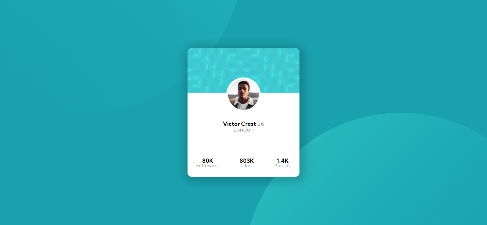
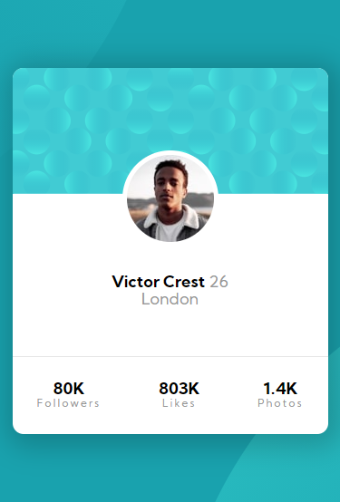

# Frontend Mentor - Profile card component solution

This is a solution to the [Profile card component challenge on Frontend Mentor](https://www.frontendmentor.io/challenges/profile-card-component-cfArpWshJ). Frontend Mentor challenges help you improve your coding skills by building realistic projects. 

## Table of contents

- [Overview](#overview)
  - [The challenge](#the-challenge)
  - [Screenshot](#screenshot)
- [My process](#my-process)
  - [Built with](#built-with)
  - [What I learned](#what-i-learned)
  - [Continued development](#continued-development)
  - [Useful resources](#useful-resources)
- [Author](#author)

## Overview

### The challenge

- Build out the project to the designs provided.

### Screenshot

## My process

### Built with

- Semantic HTML5 markup
- CSS custom properties
- Flexbox

### What I learned

I learned a lot from display flexbox in this challenge. I know I haven't used this too much in this one, but I've done a lot of research about it those days and this challenge helped me putting it in practice, so that was worth it. Along side with that, I learned some more things about position on the page and hiearchy in HTML and CSS, so that's another great point about it! I highly recommend it for the freshmen in web development, such as myself.

### Continued development

I still don't feel very confortable with absolute and relative positions as I thought I were, so that's a good thing to keep an eye on and to pratice and study more about in the future.

### Useful resources

- [Figma](https://www.figma.com/) really helped me to take measures and study the original example with more details.

## Author

Hey, my name is Lucas Nascimento and I'm learning more about web development. I've a short background with Java and C like languages, and I'm working with Salesforce platform nowadays. I'm really enjoing learning so many things at once and I hope to keep practicing and learning each day more! Take a look at my other little projects too!

- [My Github](https://github.com/nasci-ontem)